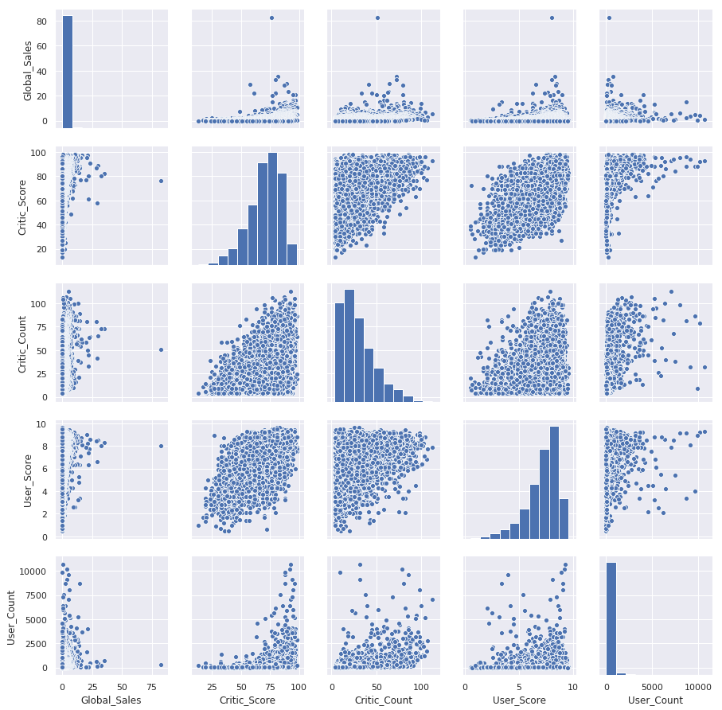
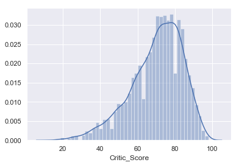
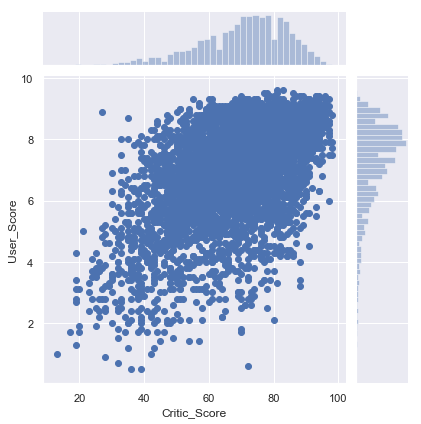
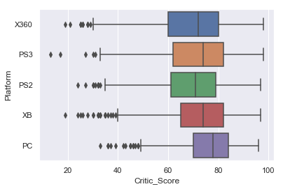
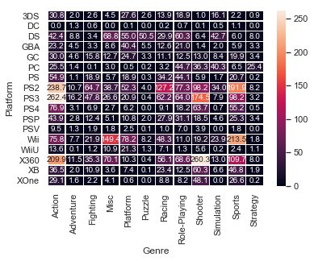

参加了 [mlcourse.ai](https://mlcourse.ai/) 的**开放式机器学习课程** [Yorko](https://github.com/Yorko)/[**mlcourse.ai**](https://github.com/Yorko/mlcourse.ai)。以下为每周的学习内容。

因为之前不太清楚相关规则和内容，前几周的内容都是后面补充的。

### 第一周 使用Pandas进行探索性数据分析

**教程：**

* [简易教程](https://nbviewer.jupyter.org/github/GuQiangJS/mlcourse.ai/blob/master/jupyter_english/topic01_pandas_data_analysis/topic1_pandas_data_analysis.ipynb)
* [简易教程 机翻中文](https://nbviewer.jupyter.org/github/GuQiangJS/mlcourse.ai/blob/master/jupyter_english/topic01_pandas_data_analysis/topic1_pandas_data_analysis_zh-cn.ipynb)

教程中演示了 `pandas` 的一些常用的方法。包含 读取数据、数据类型转换、排序、`describe`、索引、定位、`apply`、分组、`crosstab`、`pivot_table`等。以及少量的 `matplotlib` 的使用。

**教程内提供的相关网站链接：**

* [pandas官方文档](http://pandas.pydata.org/pandas-docs/stable/index.html)
* [pandas官方提供的10分钟入门](http://pandas.pydata.org/pandas-docs/stable/10min.html) 常用的 `pandas` 语法都包含了，也是个速查的入口。
* [pandas主要功能速查pdf](https://github.com/pandas-dev/pandas/blob/master/doc/cheatsheet/Pandas_Cheat_Sheet.pdf) **好东西**
* [scipy-lectures.org](http://www.scipy-lectures.org/index.html) 关于`pandas`、`numpy`、`matplotlib`和`scikit-learn`的教程

**任务：**

* [任务-使用Pandas进行探索性数据分析](https://nbviewer.jupyter.org/github/GuQiangJS/mlcourse.ai/blob/master/jupyter_english/assignments_demo/assignment01_pandas_uci_adult.ipynb)
* [任务-使用Pandas进行探索性数据分析 - 机翻中文，包含我自己的答案](https://nbviewer.jupyter.org/github/GuQiangJS/mlcourse.ai/blob/master/jupyter_english/assignments_demo/assignment01_pandas_uci_adult_zh-cn.ipynb)

主要是之前教程部分的练习。

**实践：**

* [实践 分析“泰坦尼克号”乘客](https://nbviewer.jupyter.org/github/GuQiangJS/mlcourse.ai/blob/master/jupyter_english/topic01_pandas_data_analysis/topic1_practice_pandas_titanic.ipynb)
* [实践 分析“泰坦尼克号”乘客 - 机翻中文，包含我自己的答案](https://nbviewer.jupyter.org/github/GuQiangJS/mlcourse.ai/blob/master/jupyter_english/topic01_pandas_data_analysis/topic1_practice_pandas_titanic_zh-cn.ipynb)
* [实践 分析“泰坦尼克号”乘客 包含官方答案](https://nbviewer.jupyter.org/github/GuQiangJS/mlcourse.ai/blob/master/jupyter_english/topic01_pandas_data_analysis/topic1_practice_pandas_titanic_solution.ipynb)

### 第二周 Python中的可视化数据分析

**教程：**

* [第1部分：可视化：从简单分布到降维](https://nbviewer.jupyter.org/github/GuQiangJS/mlcourse.ai/blob/master/jupyter_english/topic02_visual_data_analysis/topic2_visual_data_analysis.ipynb)
* [第1部分：可视化：从简单分布到降维 - 机翻中文](https://nbviewer.jupyter.org/github/GuQiangJS/mlcourse.ai/blob/master/jupyter_english/topic02_visual_data_analysis/topic2_visual_data_analysis_zh-cn.ipynb)

通过使用图形来分析电信用户流失的可能性来讲述了单变量可视化，多变量可视化、降维（PCA、t-SNE）

[淺談降維方法中的 PCA 與 t-SNE](https://medium.com/d-d-mag/%E6%B7%BA%E8%AB%87%E5%85%A9%E7%A8%AE%E9%99%8D%E7%B6%AD%E6%96%B9%E6%B3%95-pca-%E8%88%87-t-sne-d4254916925b)

**教程内提供的相关网站链接：**

- 这是我们使用的库的官方文档：[`matplotlib`](https://matplotlib.org/contents.html)，[`seaborn`](https://seaborn.pydata.org/introduction.html)和[`pandas`](https://pandas.pydata.org/pandas-docs/stable/)。
- 使用`seaborn`创建的示例图表的[gallery](http://seaborn.pydata.org/examples/index.html)是一个非常好的资源。
- 另请参阅`scikit-learn`中关于Manifold Learning的[documentation](http://scikit-learn.org/stable/modules/manifold.html)。
- 高效的t-SNE实施[Multicore-TSNE](https://github.com/DmitryUlyanov/Multicore-TSNE)。
- `如何有效使用t-SNE`，[Distill.pub](https://distill.pub/2016/misread-tsne/)。

---

* [第2部分：Seaborn，Matplotlib和Plotly库概述](https://nbviewer.jupyter.org/github/GuQiangJS/mlcourse.ai/blob/master/jupyter_english/topic02_visual_data_analysis/topic2_additional_seaborn_matplotlib_plotly.ipynb)
* [第2部分：Seaborn，Matplotlib和Plotly库概述 - 机翻中文](https://nbviewer.jupyter.org/github/GuQiangJS/mlcourse.ai/blob/master/jupyter_english/topic02_visual_data_analysis/topic2_additional_seaborn_matplotlib_plotly_zh-cn.ipynb)

通过示例简单描述了[pandas.DataFrame.plot](https://pandas.pydata.org/pandas-docs/stable/generated/pandas.DataFrame.plot.html)，

### Seaborn

##### [`seaborn.pairplot`](https://seaborn.pydata.org/generated/seaborn.pairplot.html)多变量之间的关系图

```python
# `pairplot()` may become very slow with the SVG format
%config InlineBackend.figure_format = 'png' 
sns.pairplot(df[['Global_Sales', 'Critic_Score', 'Critic_Count', 
                 'User_Score', 'User_Count']]);
```



##### [`seaborn.distplot`](https://seaborn.pydata.org/generated/seaborn.distplot.html?highlight=distplot#seaborn.distplot)

> 此功能将matplotlib `hist`功能（具有良好的默认箱尺寸的自动计算）与seaborn [`kdeplot()`](https://seaborn.pydata.org/generated/seaborn.kdeplot.html#seaborn.kdeplot) 和[`rugplot()`](https://seaborn.pydata.org/generated/seaborn.rugplot.html#seaborn.rugplot)功能相结合。它还可以拟合`scipy.stats` 分布并在数据上绘制估计的PDF。

```python
%config InlineBackend.figure_format = 'svg'
sns.distplot(df['Critic_Score']);
```



##### [`seaborn.jointplot`](https://seaborn.pydata.org/generated/seaborn.jointplot.html?highlight=jointplot#seaborn.jointplot)

> 用双变量和单变量图绘制两个变量的图。

```python
sns.jointplot(x='Critic_Score', y='User_Score', 
              data=df, kind='scatter');
```



##### [`seaborn.boxplot`](https://seaborn.pydata.org/generated/seaborn.boxplot.html?highlight=boxplot#seaborn.boxplot) 箱型图

> 绘制方框图以显示与类别相关的分布。

```python
top_platforms = df['Platform'].value_counts().sort_values(ascending=False).head(5).index.values
sns.boxplot(y="Platform", x="Critic_Score", 
            data=df[df['Platform'].isin(top_platforms)], orient="h");
```



{% blockquote https://zh.wikipedia.org/wiki/%E7%AE%B1%E5%BD%A2%E5%9C%96 箱型图%}

```
                            +-----+-+       
  *           o     |-------|   + | |---|
                            +-----+-+    
                                         
+---+---+---+---+---+---+---+---+---+---+   分数
0   1   2   3   4   5   6   7   8   9  10
```

这组数据显示出：

- 最小值(*minimum*)=5
- 下四分位数(*Q1*)=7
- 中位数(*Med* --也就是Q2)=8.5
- 上四分位数(*Q3*)=9
- 最大值(*maximum* )=10
- 平均值=8
- 四分位间距(interquartile range)=$(Q3-Q1)$=2 (即ΔQ)

在区间 Q3+1.5ΔQ, Q1-1.5ΔQ 之外的值被视为应忽略(farout)。

- farout: 在图上不予显示，仅标注一个符号∇。

- 最大值区间： Q3+1.5ΔQ
- 最小值区间： Q1-1.5ΔQ

最大值与最小值产生于这个区间。区间外的值被视为outlier显示在图上.

- mild outlier （离群值) = 3.5
- extreme outlier (极端值) = 0.5



##### [`seaborn.heatmap`](https://seaborn.pydata.org/generated/seaborn.heatmap.html?highlight=heatmap#seaborn.heatmap)

> 将矩形数据绘制为颜色编码矩阵。

```python
platform_genre_sales = df.pivot_table(
                        index='Platform', 
                        columns='Genre', 
                        values='Global_Sales', 
                        aggfunc=sum).fillna(0).applymap(float)
sns.heatmap(platform_genre_sales, annot=True, fmt=".1f", linewidths=.5);
```



```python
# 禁止在python运行时显示警告信息
import warnings
warnings.filterwarnings('ignore')
```

```python
# 使用svg格式绘图，会更清晰
%config InlineBackend.figure_format = 'svg'
```

#### Plotly


**任务：**

* [任务 - 分析心血管疾病数据](https://nbviewer.jupyter.org/github/GuQiangJS/mlcourse.ai/blob/master/jupyter_english/assignments_demo/assignment02_analyzing_cardiovascular_desease_data.ipynb)
* [任务 - 分析心血管疾病数据 包含官方答案](https://nbviewer.jupyter.org/github/GuQiangJS/mlcourse.ai/blob/master/jupyter_english/assignments_demo/assignment02_analyzing_cardiovascular_desease_data_solution.ipynb)

* [任务 - 美国航班的探索性数据分析（EDA）（使用Pandas，Matplotlib和Seaborn）](https://nbviewer.jupyter.org/github/GuQiangJS/mlcourse.ai/blob/master/jupyter_english/assignments_fall2018/assignment2_USA_flights.ipynb)

**实践：**

- [实践 分析“泰坦尼克号”乘客](https://nbviewer.jupyter.org/github/GuQiangJS/mlcourse.ai/blob/master/jupyter_english/topic02_visual_data_analysis/topic2_practice_visual_titanic.ipynb)
- [实践 分析“泰坦尼克号”乘客 - 机翻中文，包含我自己的答案](https://nbviewer.jupyter.org/github/GuQiangJS/mlcourse.ai/blob/master/jupyter_english/topic01_pandas_data_analysis/topic1_practice_pandas_titanic_zh-cn.ipynb)
- [实践 分析“泰坦尼克号”乘客 包含官方答案](https://nbviewer.jupyter.org/github/GuQiangJS/mlcourse.ai/blob/master/jupyter_english/topic02_visual_data_analysis/topic2_practice_visual_titanic_solution.ipynb)